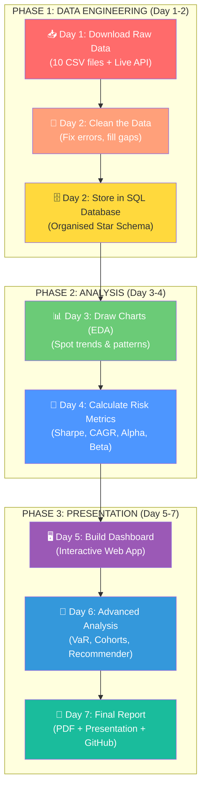
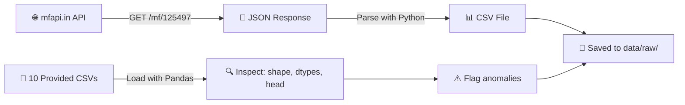
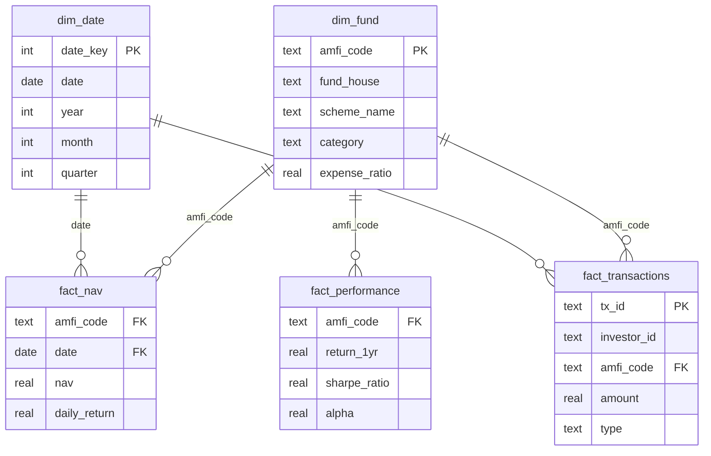
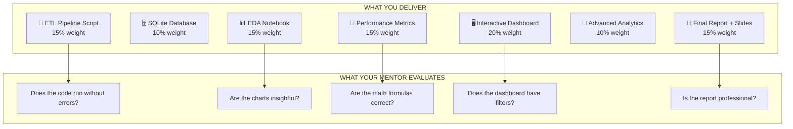

# 🏗️ Bluestock Mutual Fund Capstone — Complete E2E Explanation

> **What is this project?** You are building a complete data analytics platform for Indian Mutual Funds. You start with messy raw data, clean it, store it in a database, draw charts, calculate risk metrics, build a dashboard, and present everything in a report. This is exactly what a Data Analyst does at a real Fintech company like Zerodha, Groww, or Paytm Money.

---

## 🗺️ The Big Picture Flowchart



---

## 📦 What Are The 10 Datasets?

Think of these 10 CSV files as **10 different spreadsheets** that together tell the complete story of Indian Mutual Funds:

| # | File | Rows | What It Contains | Layman Analogy |
|---|------|------|-----------------|----------------|
| 1 | `01_fund_master.csv` | 40 | The "phone book" of all 40 mutual funds — names, categories, fees | A contact list of 40 friends |
| 2 | `02_nav_history.csv` | ~46,000 | Daily prices (NAV) of all 40 funds from 2022-2026 | Daily stock prices on a ticker |
| 3 | `03_aum_by_fund_house.csv` | ~90 | How much money each fund company manages, by quarter | Comparing bank account sizes |
| 4 | `04_monthly_sip_inflows.csv` | 48 | How much money retail investors put in every month via SIP | Monthly salary deposits |
| 5 | `05_category_inflows.csv` | ~144 | Which *type* of fund (Large Cap, Small Cap) got the most money | Which restaurant got the most customers |
| 6 | `06_industry_folio_count.csv` | 21 | Total investor accounts over time | How many people signed up |
| 7 | `07_scheme_performance.csv` | 40 | Pre-calculated returns, Sharpe ratio, risk for each fund | Report cards for each fund |
| 8 | `08_investor_transactions.csv` | ~32,000 | Individual buy/sell transactions by 5,000 fake investors | Bank transaction history |
| 9 | `09_portfolio_holdings.csv` | ~320 | Which stocks each fund actually owns (Reliance, TCS, etc.) | What's inside each fund's shopping cart |
| 10 | `10_benchmark_indices.csv` | ~8,000 | Daily values of Nifty 50, Nifty 100, etc. (the "market average") | The class average score to compare against |

---

## 📅 Day-by-Day Breakdown

---

### 📥 DAY 1 — Data Ingestion (ETL: Extract)

**Technical:** We wrote two Python scripts:
1. [data_ingestion.py](file:///d:/DOWNLOADS/Codes/blue-stock-project/Day%201/data_ingestion.py) — Loads all 10 CSV files using `pandas.read_csv()`, prints `.shape` / `.dtypes` / `.head()` for each, flags anomalies (missing values, duplicates), and validates that every AMFI code in the fund master exists in the NAV history.
2. [live_nav_fetch.py](file:///d:/DOWNLOADS/Codes/blue-stock-project/Day%201/live_nav_fetch.py) — Hits the free `mfapi.in` REST API (`GET https://api.mfapi.in/mf/{code}`) to download real-time NAV data for 6 blue-chip funds (HDFC Top 100, SBI Bluechip, ICICI Bluechip, Nippon Large Cap, Axis Bluechip, Kotak Bluechip). Parses the JSON response and saves each as a CSV.

**🍕 Layman Example:** Imagine you're opening a pizza restaurant. Day 1 is going to the wholesale market and bringing home all the raw ingredients — flour, cheese, sauce, vegetables. You also check if anything is expired or missing. That's what `data_ingestion.py` does with data.



**Key output:** 10+ CSV files in `data/raw/`, a data quality report, `requirements.txt`

---

### 🧹 DAY 2 — Data Cleaning + SQL Database

**Technical:** [day2_data_cleaning.py](file:///d:/DOWNLOADS/Codes/blue-stock-project/Day%202/day2_data_cleaning.py) does three critical cleaning jobs:
1. **NAV History:** Parses dates to `datetime`, sorts by fund+date, removes duplicates, forward-fills missing NAV for weekends/holidays (so Saturday gets Friday's price), and validates NAV > 0.
2. **Investor Transactions:** Standardises `transaction_type` (SIP/Lumpsum/Redemption), validates `amount > 0`, fixes date formats, checks KYC status is only Verified/Pending/Rejected.
3. **Scheme Performance:** Converts return percentages from text to numbers, flags anomalies (>100% or <-50% returns), validates expense ratios are within SEBI legal limits (0.1%-2.5%).

Then it creates a **Star Schema** in SQLite:



**🍕 Layman Example:** Day 2 is washing the vegetables, checking if the cheese is mouldy, and organizing everything neatly into labelled containers in your fridge (the database). You throw away the bad stuff, and you label every container so you can find it instantly later.

**Key output:** 10 cleaned CSVs in `data/processed/`, `bluestock_mf.db` (SQLite database), `schema.sql`, `queries.sql`, `data_dictionary.md`

---

### 📊 DAY 3 — Exploratory Data Analysis (EDA)

**Technical:** [03_eda_analysis.ipynb](file:///d:/DOWNLOADS/Codes/blue-stock-project/Day%203/03_eda_analysis.ipynb) creates 15+ charts:
- **NAV Trend Lines** (Plotly) — Daily prices for all funds, with green/red bands highlighting the 2023 bull run and 2024 correction
- **AUM Bar Chart** (Seaborn) — Grouped bars showing SBI's dominance at ₹12.5L Cr
- **SIP Inflow Line** (Plotly) — Monthly SIP trend with the ₹31,002 Cr all-time high annotated
- **Sector Donut Chart** — Where the fund money actually goes (IT, Banks, Pharma)

**🍕 Layman Example:** Before baking, you taste the batter. EDA is "looking" at your data using pretty pictures. You're asking: "What happened in the market? Who's the biggest player? Are people investing more or less?" You're being a detective.

**Key output:** `03_eda_analysis.ipynb` with 15+ charts, exported PNG images

---

### 🧮 DAY 4 — Fund Performance Analytics

**Technical:** [04_performance_analytics.ipynb](file:///d:/DOWNLOADS/Codes/blue-stock-project/Day%204/04_performance_analytics.ipynb) computes:

| Metric | Formula | What It Tells You |
|--------|---------|-------------------|
| **Daily Return** | `(NAV_today / NAV_yesterday) - 1` | How much did the fund gain/lose today? |
| **CAGR** | `(NAV_end / NAV_start)^(1/years) - 1` | Average yearly growth rate |
| **Sharpe Ratio** | `(Return - 6.5%) / Volatility × √252` | "Was the stress worth the money?" |
| **Sortino Ratio** | `(Return - 6.5%) / Downside_Volatility` | Same as Sharpe but only penalises bad days |
| **Alpha** | OLS regression intercept × 252 | "Is the fund manager skilled or just lucky?" |
| **Beta** | OLS regression slope | "How bouncy is this fund vs the market?" |
| **Max Drawdown** | `min(NAV / running_max - 1)` | "What was the worst crash?" |
| **Fund Score (0-100)** | Weighted rank of all above | Final grade for each fund |

**🍕 Layman Example:** In school, getting 90/100 marks is great. But what if you studied 16 hours a day and destroyed your health? The Sharpe Ratio asks: "Was the effort (risk) worth the result (return)?" Alpha asks: "Did you actually study smart, or did you just get lucky because the exam was easy (the whole market went up)?"

**Key output:** `fund_scorecard.csv`, `alpha_beta.csv`, benchmark comparison chart

---

### 🖥️ DAY 5 — Dashboard (Streamlit Bonus!)

**Technical:** [app.py](file:///d:/DOWNLOADS/Codes/blue-stock-project/Day%205/app.py) builds a Streamlit web application with:
- 4 KPI cards (Total AUM, SIP Inflow, Folios, Schemes)
- Interactive Plotly charts (SIP trend line, AUM bar chart)
- Sidebar filters (Year selection)
- Reads from the SQLite database or falls back to raw CSVs

**🍕 Layman Example:** Instead of showing your boss a boring Excel spreadsheet, you build a beautiful website where they can click buttons, filter by year, and see the numbers change in real-time. It's like going from a paper menu to a touchscreen ordering kiosk at a restaurant.

**Key output:** `app.py` (run with `streamlit run "Day 5/app.py"`)

---

### 🔬 DAY 6 — Advanced Analytics + Risk

**Technical:** [05_advanced_analytics.ipynb](file:///d:/DOWNLOADS/Codes/blue-stock-project/Day%206/05_advanced_analytics.ipynb) and [recommender.py](file:///d:/DOWNLOADS/Codes/blue-stock-project/Day%206/recommender.py):

| Analysis | What It Does |
|----------|-------------|
| **VaR (Value at Risk, 95%)** | "95% of the time, the worst daily loss won't exceed X%" |
| **CVaR (Conditional VaR)** | "If it DOES exceed VaR, the average loss is Y%" |
| **Sector HHI** | Measures portfolio concentration — is the fund putting all eggs in one basket? |
| **Cohort Analysis** | Groups investors by when they started (2022 vs 2024) and compares behaviours |
| **Fund Recommender** | Input your risk appetite (Low/Moderate/High) → get top 3 funds by Sharpe Ratio |

**🍕 Layman Example:** VaR is like weather forecasting — "There's a 95% chance it won't rain more than 5mm tomorrow. But if it does rain harder, expect around 10mm on average (CVaR)." The recommender is like a Netflix recommendation engine, but for mutual funds — "Based on your taste (risk appetite), we suggest these 3 funds."

**Key output:** `var_cvar_report.csv`, `recommender.py`, `05_advanced_analytics.ipynb`

---

### 📝 DAY 7 — Final Report + Presentation

**Technical:** [Final_Report_Template.md](file:///d:/DOWNLOADS/Codes/blue-stock-project/Day%207/Final_Report_Template.md) provides the complete structure:
- Executive Summary → Architecture → EDA Findings → Risk Analytics → Recommendations → Limitations
- Convert to PDF using Word/Google Docs
- Create a 12-slide PowerPoint deck
- Push everything to GitHub with a professional [README.md](file:///d:/DOWNLOADS/Codes/blue-stock-project/README.md)

**🍕 Layman Example:** Day 7 is plating the food, decorating the table, and presenting it to the restaurant critics. The food (analysis) was done earlier — now you make it look professional so the judges (your mentor) are impressed.

**Key output:** `Final_Report.pdf`, `Presentation.pptx`, clean GitHub repo

---

## 🎯 The End Goal



**In one sentence:** You are proving that you can take messy, real-world financial data, clean it, analyse it, build beautiful visualisations, compute accurate risk metrics, and present actionable insights — which is exactly what a Fintech Data Analyst does every single day.

---

## 📁 Final Folder Structure

```
blue-stock-project/
├── Day 1/                          ← Data Ingestion (ETL Extract)
│   ├── data_ingestion.py           ← Loads & inspects all 10 CSVs
│   ├── live_nav_fetch.py           ← Fetches live NAV from mfapi.in
│   └── requirements.txt            ← Python dependencies
├── Day 2/                          ← Data Cleaning + SQL
│   ├── day2_data_cleaning.py       ← Cleans data & loads into SQLite
│   ├── data_dictionary.md          ← Column definitions & sources
│   └── sql/                        ← schema.sql + queries.sql
├── Day 3/                          ← Exploratory Data Analysis
│   └── 03_eda_analysis.ipynb       ← 15+ charts (Plotly, Seaborn)
├── Day 4/                          ← Performance Analytics
│   └── 04_performance_analytics.ipynb ← Sharpe, CAGR, Alpha, Beta
├── Day 5/                          ← Interactive Dashboard
│   └── app.py                      ← Streamlit web app (Bonus!)
├── Day 6/                          ← Advanced Analytics
│   ├── 05_advanced_analytics.ipynb ← VaR, HHI, Cohorts
│   └── recommender.py              ← Fund recommendation engine
├── Day 7/                          ← Final Documentation
│   └── Final_Report_Template.md    ← Report template for PDF
├── data/                           ← Centralised data store
│   ├── raw/                        ← 10 original CSV files
│   ├── processed/                  ← Cleaned CSVs
│   └── db/                         ← bluestock_mf.db (SQLite)
├── Bluestock_MF_Capstone_Project.pdf  ← Project brief PDF
├── Bluestock whole 7 days plan INTERN.pdf ← Detailed day plan PDF
├── E2E_Process_Explained.md        ← This file!
└── README.md                       ← How to run the project
```

---
*Built for the Bluestock Fintech Data Analyst Internship Capstone Project — June 2026*
