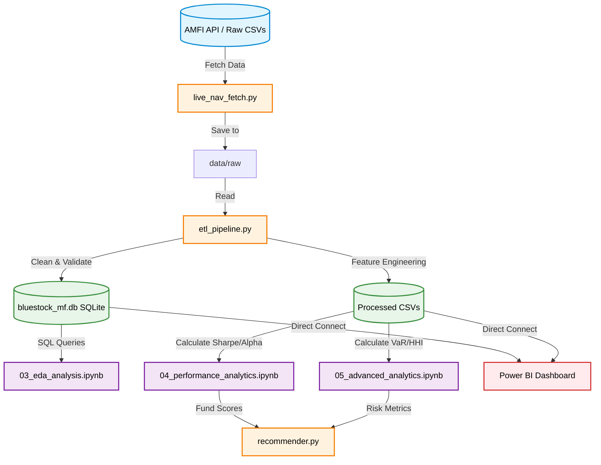

# Bluestock Mutual Fund Analytics Capstone

Welcome to the **Bluestock Fintech Data Analyst Internship Capstone Project**. This repository contains an end-to-end data engineering, analytics, and Business Intelligence pipeline built to analyze the Indian Mutual Fund industry.

---

## 📂 Project Structure

This repository follows a professional data science folder structure to ensure clean separation of data, logic, and presentation.

```text
bluestock_mf_capstone/
├── data/
│   ├── raw/             ← Original ingested CSVs & API downloads
│   ├── processed/       ← Cleaned data, engineered features & analytics outputs
│   └── db/              ← SQLite Data Warehouse (bluestock_mf.db)
├── notebooks/           ← Jupyter notebooks for Exploratory Data Analysis
│   ├── 01_data_ingestion_eda.ipynb
│   ├── 03_eda_analysis.ipynb
│   ├── 04_performance_analytics.ipynb
│   └── 05_advanced_analytics.ipynb
├── scripts/             ← Executable Python scripts for the pipeline
│   ├── etl_pipeline.py  ← Ingests, cleans, and loads data to SQLite
│   ├── live_nav_fetch.py← Connects to mfapi.in to fetch live NAV data
│   ├── recommender.py   ← Algorithmic fund recommendation engine
├── sql/                 ← Database definitions and queries
│   ├── schema.sql
│   └── queries.sql
├── dashboard/           ← BI Dashboard files (Created personally in Power BI)
│   ├── bluestock_mf.pbix← Interactive Power BI Dashboard
│   └── img/             ← Dashboard screenshot outputs uploaded here
├── reports/             ← Final deliverables
│   ├── Final_Report.pdf
│   ├── Presentation.pptx
│   └── data_quality_report.txt
├── run_pipeline.py      ← Master execution script
└── README.md
```

---

## 🗺️ Pipeline Flowchart

The following diagram illustrates the complete end-to-end flow of data from raw ingestion to the final dashboard and reports.



---

## 🚀 How to Run the Project

### Step 1: Environment Setup
Ensure you have Python 3.9+ installed. Install the required dependencies:
```bash
pip install pandas numpy matplotlib seaborn plotly sqlalchemy requests fpdf2 python-pptx jupyter
```

### Step 2: One-Click Execution
The entire pipeline can be executed sequentially using the master script. This will run the ETL pipeline, compute all performance metrics, and generate the final outputs.
```bash
python run_pipeline.py
```

### Step 3: View Analytics
Once the pipeline finishes, you can manually explore the notebooks for deeper insights:
```bash
jupyter notebook
```
Navigate to the `notebooks/` directory and open:
*   `03_eda_analysis.ipynb`
*   `04_performance_analytics.ipynb`
*   `05_advanced_analytics.ipynb`

### Step 4: Run the Recommender
Test the algorithmic mutual fund recommendation engine based on your risk profile:
```bash
python scripts/recommender.py
```
*(Inside the script, you can test 'low', 'moderate', or 'high' risk profiles)*

### Step 5: View the Dashboard
1. Download and install **Power BI Desktop**.
2. Open `dashboard/bluestock_mf.pbix`.
3. The dashboard connects directly to the `bluestock_mf.db` database generated in Step 2.

---

## 📊 Deliverables Included

*   **Final Report**: `reports/Final_Report.pdf` (16 pages of comprehensive analysis)
*   **Presentation Deck**: `reports/Presentation.pptx` (12 slides)
*   **Database**: `data/db/bluestock_mf.db` (Star Schema)
*   **Interactive Dashboard**: `dashboard/bluestock_mf.pbix` (4 pages)

---
*Developed by Damodara P | Data Analyst Intern | Bluestock Fintech*
